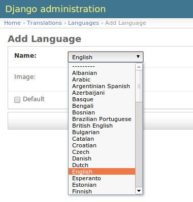
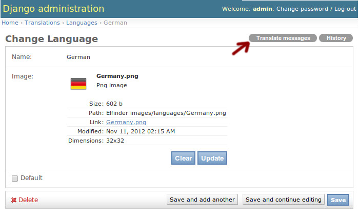
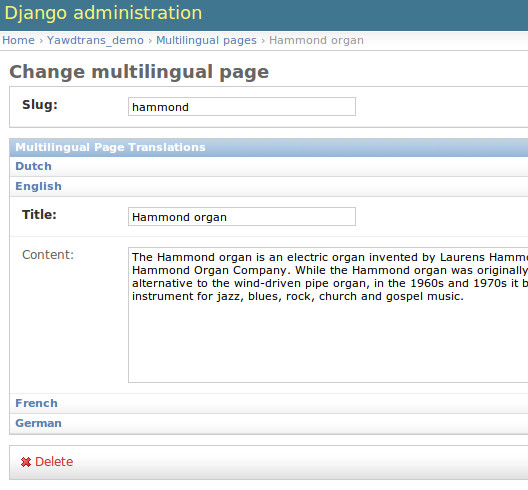

.. _usage:

***********************
Using yawd-translations
***********************

.. _languages-model:

The Languages model
+++++++++++++++++++

yawd-translations implements a :class:`translations.models.Language` model that allows
you to manage a website's languages through the admin interface. To use it you need to
enable yawd-translations in your project ``settings.py`` file:

.. code-block:: python

	 ...
	 INSTALLED_APPS = (
	 	...
	 	'translations',
	 	'yawd-elfinder' #yawd-translations prerequisite
	 )

Also make sure your ``MEDIA_ROOT`` setting is set for the language image to work.

Working with Languages
----------------------

You can set a single language as `default` (e.g. see image above). This will act as the 
language to which your pages will be translated unless another language is activated. 
yawd-translations will ensure that only one default language is set at the model level.

The set of languages from which a user can choose is the one defined in
django's `LANGUAGES <https://docs.djangoproject.com/en/dev/ref/settings/#languages>`_
setting. The :class:`translations.models.Language` model uses language codes as 
primary keys (to eliminate the need of database joins), where codes are the same as 
django language codes. As a result, the django built-in 
`translation methods and template-tags <https://docs.djangoproject.com/en/dev/topics/i18n/translation/>`_ 
can be used. For example, to activate a language:

.. code-block:: python
	 
	 from django.utils.translation import activate
	 from translations.models import Language
	 
	 language = Language.objects.get(default=True)
	 activate(language.pk)
	 
...or in your templates to get language info (with the `language` context variable referring to a
db Language instance):

.. code-block:: django

	
	
If you assign an image to the language, you can retrieve it in your templates like this
(this is all you'll need, but you still can find more in the 
`yawd-elfinder documentation <http://yawd-elfinder.readthedocs.org/>`_):

.. code-block:: django

	
	
yawd-translations will add the Languages model to the admin interface so do not forget
your ``admin.autodiscover()`` in your root urls.py module:

.. code-block:: python

	from django.contrib import admin
	admin.autodiscover()

Utility functions
-----------------

yawd-translations provides a set of utility functions to access the available languages.
To get a flat list of the available **language codes** (e.g. `['en', 'de', 'fr']`),
use :func:`translations.utils.get_supported_languages`. For example, in your views: 

.. code-block:: python
	
	from translations.utils import get_supported_languages
	
	return render_to_response('mytemplate.html', {
    	'available_languages': get_supported_languages(),
	}, RequestContext(request))
	
...and then in your templates use it with django built-in template tags:

.. code-block:: django

	
	 ... 

To get the default **language code**, use :func:`translations.utils.get_default_language`.
For example to check if the english language is the default:

.. code-block:: python

	from translations.utils import get_default_language
	
	if 'en' == get_default_language():
		..do stuff..

Using the utility functions in your code is the recommended way of retrieving language
codes, since they do not produce database queries. For example the above snippet could
also be written as:

.. code-block:: python

	from translations.models import Language
	
	lang = Language.objects.get(pk='en')
	if lang.default:
		..do stuff..
		
...but this is not preferred over the previous solution since it would hit the database.

.. note::
	When no languages are set (e.g. when making your first ``syncdb``) these two methods
	will return the value of the global django 
	`LANGUAGE_CODE <https://docs.djangoproject.com/en/dev/ref/settings/#std:setting-LANGUAGE_CODE>`_
	setting instead.

.. _translation-messages:

Static translation messages
+++++++++++++++++++++++++++

Once yawd-translations is enabled (see :ref:`languages-model` above) you can also edit
the static translation strings through the admin interface without the need of using
the `makemessages <https://docs.djangoproject.com/en/dev/ref/django-admin/#django-admin-makemessages>`_ 
and `compilemessages <https://docs.djangoproject.com/en/dev/ref/django-admin/#compilemessages>`_ 
commands, or restarting the web server. To activate this feature you need to define a 
directory where yawd-translations will store the ``.po`` and ``.mo`` files. 
yawd-translations uses for this purpose the **first** listing (could be more than one) 
of django's `LOCALE_PATHS <https://docs.djangoproject.com/en/dev/ref/settings/#std:setting-LOCALE_PATHS>`_
project setting. In your ``settings.py`` file:

.. code-block:: python

	...
	LOCALE_PATHS = (
		'/path/to/the/translations/folder/',
		...possibly more directories
	)

.. hint::

	yawd-translations allows you to modify the translation messages of all
	``INSTALLED_APPS`` using the admin interface. Overwriting original translation
	files inside an application's source code is not an option, therefore modified
	translation messages must be stored elsewhere. Since ``LOCALE_PATHS`` have a higher
	priority over an application's own translation files, we choose to use this setting 
	for our purposes. Behind the scenes yawd-translations will ``makemessages`` 
	for a given language and then move the generated files to the directory 
	dictated by this setting. When you modify a translation message using the admin 
	interface, your change will be stored to the copied ``.po`` file, yawd-translations
	will ``compilemessages`` and load the new translations.
  

To use this feature navigate to the change page of a Language (image below) and select
the `'Translate messages'` tool in the upper-right corner.

In the `'Translate messages'` page you can see two new tool buttons - again located 
in the upper-right corner: 
`'Regenerate messages'` and `'Update messages'` (if no messages exist for this language
you will only see the first tool, labeled `'Generate messages'` instead). Both actions
will scan the installed applications for static translation messages. The only 
difference between them is that the first will **override any changes** you might 
have made so far, while the latter will just update your existing translations with 
possible new translation strings added to the code since your last scan.

.. note::

	yawd-translations will generate translation messages only for applications having
	a `locale` directory in their source code. More information can be found on the
	django documentation `here <file:///home/ppetrid/work/freelance/yawdcms/workspace/yawd-translations/docs/build/html/usage.html#the-languages-model>`_.
	
You can control which users and groups can view or edit the translation messages
(e.g. through the admin interface). yawd-translations provides two custom permissions
for this matter: `'Can see translation messages for a language'` and
`'Can edit the language's translation messages'`.

.. _translatable-models:

Translatable models API
+++++++++++++++++++++++

To allow for models whose fields can be translated in all languages,
yawd-translations implements two abstract models;
:class:`translations.models.Translatable` and 
:class:`translations.models.Translation`. Use the first to define a model that can
be translated and the latter to define its translations. With this approach we can 
have both fields that are common to all languages and fields that must have a 
different translation in each language. 

A `Translatable` defines a model that can be translated in all languages. Its 
models fields will be **common** to all languages. The `Translation` model
defines all fields that should have a different version in each language. It
should have a `ForeignKey <https://docs.djangoproject.com/en/dev/ref/models/fields/#django.db.models.ForeignKey>`_ 
to the `Translatable`.

.. code-block:: python

	from django.db import models
	from translations.models import Translatable, Translation 

	class Product(Translatable):
		sku = models.CharField(max_length=20)
		price = models.FloatField()
		
	class ProductTranslation(Translation)
		#note the related_name, this is important
		product = models.ForeignKey(Product, related_name='translations')
		title = models.CharField(max_length=100)
		description = models.TextField(blank=True)
		
		def __unicode__(self):
			return u'%s' % self.title
        	
The above example implements a `Product` model whose `'sku'` and `'price'` will be always the same
regardless of the language, and a `ProductTranslation` whose `'description'` and `'title'`
depend on the language. There are two things to notice here:

* The reverse relation **must** be named 'translations'. Given a `Product` instance we should be able to access its translations through the ``product.translations`` attribute since yawd-translations uses this property in various places.
* In the `Product` model we have not defined a ``__unicode__()`` method. yawd-translations provides a default implementation that will attempt to load the related translation's unicode for the active language. For more information on how this works view the :func:`translations.models.Translatable.get_name` method. You can always override the default ``__unicode__()`` implementation in your models.

.. _access-translations:

How to access translations
--------------------------

The recommended way of retrieving a translation for a given language is using the
:func:`translations.models.Translatable.translation` method provided in the API.
Since `Translatable` models use a custom 
`Queryset Manager <https://docs.djangoproject.com/en/dev/topics/db/managers/>`_
to prefetch related translations and minimize the db hits, this method takes advantage
of the cached translations to quickly locate the desired translation. This is a typical 
example::

	>>> from django.utils.translation import activate 
	>>> product = Product.objects.get(sku='123')
	>>> activate('en')
	>>> product.translation()
	<ProductTranslation: English product title>
	>>> activate('de')
	>>> product.translation()
	<ProductTranslation: German product title>
	>>> product.translation('en')
	<ProductTranslation: English product title>
	>>> product.translation().description
	u'Fancy german product description'
	
The `'translation()'` method can also be used in your templates:

.. code-block:: django

	{{product.translation.description}}
	
To generate a filtered list of translations it is always a good idea to  use the 
``translations.all()`` queryset. For example to filter translations that have a 
`'description'` we should prefer::

	>>> translations = [p for p in product.translations.all() if p.description]
	
...over::

	>>> translations = product.translations.exclude(description='')
	
...since the first approach will not hit the database.

.. note::
	There exist several approaches for storing multilingual content in databases. 
	If you need a different approach than the one implemented in yawd-translations,
	you could just use the :ref:`languages-model` and design your own application
	models from scratch. The :ref:`translatable-models` comes with a 
	:ref:`custom-admin-inline` (to manage translations through the admin interface) 
	which you will not be able to use while not using the API. The :ref:`translation-urls`
	could still be used if your models provide a ``get_absolute_url()``
	method.

.. _custom-admin-inline:

Translation admin inline
++++++++++++++++++++++++

When using the :ref:`translatable-models`, an elegant and easy to use way of presenting 
`Translation` models in the admin interface is using 
`admin inlines <https://docs.djangoproject.com/en/dev/ref/contrib/admin/#django.contrib.admin.InlineModelAdmin>`_.
It allows the user to edit a `Translatable` and its `Translation` objects in a single
web page. 

You can use the :class:`translations.admin.TranslationInline` like you would normally
use any django ``StackedInline`` or ``TabularInline`` in your admin.py, but it will
work for :class:`translations.models.Translation` models only. In your ``admin.py``:

.. code-block:: python

	from django.contrib import admin
	from translations.admin import TranslationInline

	class ProductTranslationAdmin(TranslationInline):
		model =  ProductTranslation

	class ProductAdmin(admin.ModelAdmin):
		inlines = [ProductTranslationAdmin]

	admin.site.register(Product, ProductAdmin)

The above snippet refers to the `Product` and `ProductTranslation` models of the previous :ref:`products example <translatable-models>`.

Screenshot of the :ref:`translatable-models` of the :ref:`yawd-translations demo project <demo-project>`:

.. _translations-middleware:

The Translations middleware
+++++++++++++++++++++++++++

Django provides a `django.middleware.locale.LocaleMiddleware <https://docs.djangoproject.com/en/dev/topics/i18n/translation/#how-django-discovers-language-preference>`_
that should be enabled when working with internationalized projects. Although
yawd-translations builds upon the original django translation mechanism, 
this middleware is unaware of our default language (which is stored in the database if
at least one :class:`translations.models.Language` is set) and will not use it as
the default project language. To solve this issue we have implemented the
:class:`translations.middleware.TranslationMiddleware` middleware that will determine
the current language as follows (as opposed to the original
`language discovery algorithm <https://docs.djangoproject.com/en/dev/topics/i18n/translation/#how-django-discovers-language-preference>`_):

* First, it looks for the language prefix in the requested URL. This is only performed when you are using the `i18n_patterns <https://docs.djangoproject.com/en/dev/topics/i18n/translation/#django.conf.urls.i18n.i18n_patterns>`_ or the :func:`translations.urls.translation_patterns` function in your root URLconf.
* Failing that, it looks for a django_language key in the current user's session.
* Failing that, it looks for a cookie. The name of the cookie used is set by the LANGUAGE_COOKIE_NAME setting. (The default name is django_language.)
* Failing that, it uses the global default :class:`translations.models.Language` (if no Language is set, the :func:`translations.utils.get_default_language` will return the  global ``LANGUAGE_CODE`` setting, so this will be used instead).

To enable the Translations middleware in your global settings.py:

.. code-block:: python

	...
	MIDDLEWARE_CLASSES = (
		'translations.middleware.TranslationMiddleware',
		...
	)	
	
	
If you use the ``SessionMiddleware``, ``TranslationMiddleware`` should come after it
since the latter could use session data. Also make sure the ``TranslationMiddleware``
is one of your first middlewares and that the original 
:class:`django.middleware.locale.LocaleMiddleware` is not enabled.

The Translations middleware can be used in conjuction with both 
`i18n_patterns <https://docs.djangoproject.com/en/dev/topics/i18n/translation/#django.conf.urls.i18n.i18n_patterns>`_
and :ref:`translation_patterns <translation-patterns>`. When using the first 
(and the default language is english for example) it will redirect all calls
to the `'/whatever/'` URL to `'/en/whatever/'`, while when using the latter it will
do the exact opposite redirection.

Another minor enchancement of the Translations middleware against the original
is that it uses permanent redirects (301) instead of temporary (302) when redirecting
URLs. For more information on this, read this 
`blog post <http://blog.yawd.eu/2012/impact-django-page-redirects-seo/>`_.

In theory you do not need to have `yawd-translations` in your installed applications
to use this middleware. If you do not want to build upon yawd-translations' db Language 
functionality and you're ok with the modified language discovery algorithm, you could
use it in conjuction with the :ref:`translation_patterns <translation-patterns>` or just for the permanent
redirect fix.

.. _translation-patterns:

Translation patterns
--------------------

In Django 1.4 `i18n_patterns <https://docs.djangoproject.com/en/dev/topics/i18n/translation/#django.conf.urls.i18n.i18n_patterns>`_
were introduced to allow for URLs that change based on the language. For example
`'/en/contact/'` could show the english contact page and `'/fr/contact/'` could
show the french contact page. i18n_patterns do not match against a default
language. A `'/contact/'` url will not match and the default ``LocaleMiddleware``
will redirect to `'/en/contact/'` if the default language is english.

yawd-translations implements the :func:`translations.urls.translation_patterns` 
pattern function, that will do the exact opposite: it will match `'/contact/'` as the default permalink and reject
`'/en/contact/'`. :ref:`translations-middleware` will then make sure all cals to
`'/en/contact/'` are redirected to `'/contact/'`. This is a more common practise in
web development, both for search-engine optimization and consistency reasons.

An example use of translation_patterns is the following (in your urls.py):

.. code-block:: python

	from django.conf.urls import url
	from translations.urls import translation_patterns
	#import the view as well :)
	
	urlpatterns += translation_patterns('',
		url(r'^contact/$', ContactView.as_view(), name='contact-view'),
		...
	)
	 
To use the ``translation_patterns``, the :ref:`TranslationMiddleware <translations-middleware>` must be enabled.

Additional tools
++++++++++++++++

.. _languages-context-processor:

Languages context processor
---------------------------

You can use the ``languages`` context processor
to add a list of the available languages, the default language code and the clean
current url (the url path with the language code prefix stripped out) to templates
``RequestContext``. For more information on what is being added, view 
:func:`translations.context_processors`. You can enable the processor as follows
(in your global `settings.py`):

.. code-block:: python
	
	...
	TEMPLATE_CONTEXT_PROCESSORS = (
		'translations.context_processors.languages',
		...
	)
	

.. _translation-urls:
 
translation_urls template tag
-----------------------------

A common operation when working with multilingual websites is to implement
a 'language switcher', that links to the equivalent URL for each available language.
yawd-translations provides a simple template tag that accepts a model object as 
argument and prints out all urls for this object, using the ``get_absolute_url()``
method. If no url exists for a certain language it will link to the homepage
(e.g. `'/de/'`) of that language. Example use:

.. code-block:: django

	
	
	


	
... where product could be an instance of the following model:

.. code-block:: python

	class Product(Translatable):
	
		....
		@models.permalink
		get_absolute_url(self):
			return ('my-view', (), {'pk' : self.pk })
			
If the context object variable is an instance of :class:`translations.models.Translatable`
and it has no ``get_absolute_url()`` method, the tag will search for a
``get_absolute_url()`` implementation in the related 
:class:`translations.models.Translation` and use that instead. Failing that, it
will return the home url for that language.

You can see the ``translation_urls`` template tag in action in the 
:ref:`demo-project`.
   